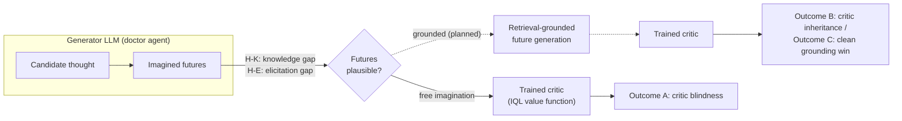
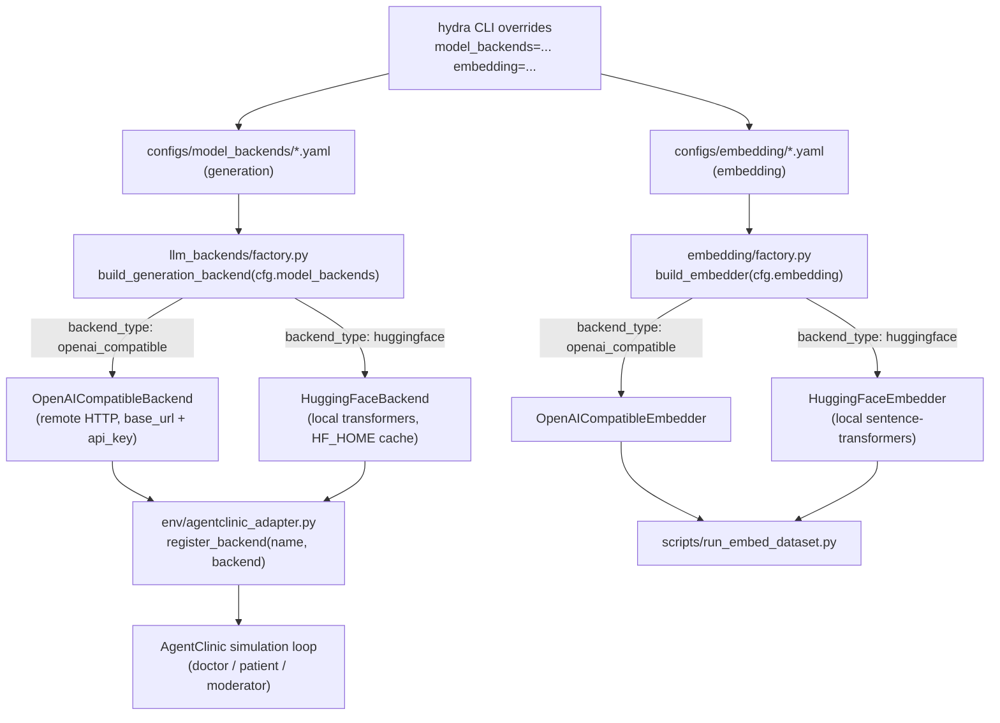
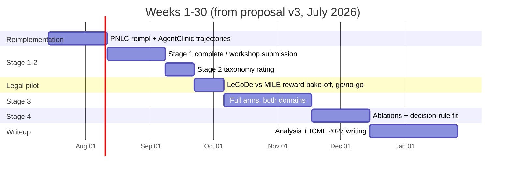

# pnlc-agentclinic

Testbed for **"Do Trained Critics Correct or Inherit Generator Failures?"** — a study of whether
PNLC's trained natural-language critic corrects or inherits the imagination failures of its
generator LLM in knowledge-heavy, multi-turn domains, and where retrieval grounding must sit to fix
it if it doesn't. Primary domain: clinical diagnosis via [AgentClinic](https://arxiv.org/abs/2405.07960)
(MedQA). Second domain (planned): interactive legal consultation via
[LeCoDe](https://arxiv.org/abs/2505.19667).

> This README is a living document — update it as stages complete, domains get added, or the plan
> changes. Don't let it drift from what's actually implemented.

## Research context

A generator LLM proposes candidate actions; a trained evaluator (here, an IQL value function over
natural-language thoughts, per [PNLC](https://arxiv.org/abs/2505.18098)) scores imagined futures for
each candidate. The evaluator only ever sees futures the generator imagines. The central question:

> When the generator's imagination fails in a knowledge-heavy domain, does the trained critic
> **correct** the failure, or **inherit** it? And if it inherits it, where must external
> (retrieval) grounding sit to restore the promise?



Full design (mechanism taxonomy, matched-futures diagnostic, domain-selection rationale, timeline)
lives in the proposal doc shared with this repo — treat that as the source of truth for *why*;
this README tracks *what's built*.

## Status

| Stage | What it needs | Status |
|---|---|---|
| PNLC reimplementation on AgentClinic (Stage 1 / RQ1) | Faithful port, doctor/patient/critic loop, plausibility rubric | Baseline (CoT-floor) harness built (`scripts/run_stage1_*.py`, `env/agentclinic_adapter.py`); not yet validated against original-domain numbers. The actual PNLC mechanism (imagine futures → score with IQL critic → select) is not yet implemented |
| Multi-backend model plumbing | Swap generation/embedding models without code changes | Done — see [Backend architecture](#backend-architecture) |
| State summarization | Summarize dialogue state for the critic loop | `StateSummarizer` implemented (`summarization/summarizer.py`), used to build embeddable state summaries in `scripts/run_embed_dataset.py` |
| Trajectory embedding pipeline | Turn logged trajectories into (state, thought) embeddings for later retrieval/critic work | `scripts/run_embed_dataset.py` built on top of `data/schema.py`'s `TrajectoryField` schema; embedding backend validated locally via HF |
| HER relabeling for goal-conditioned IQL | Turn embedded trajectories into `(s, thought, s', g, r)` tuples for value-function training | `value_learning/her_relabel.py` + `scripts/run_relabel_dataset.py`; goal set is `t' >= t` (inclusive of current state) per HER's actual definition, `r(s,g) = 1[goal_idx == i]`, no `done` mask needed since dialogue state (`agent_hist`) only ever grows within a trajectory |
| Goal-conditioned IQL critic training | Train `Q(state, thought, goal)` and `V(state, goal)` from relabeled tuples | Training entrypoint implemented in `scripts/train_critic.py`; checkpoint loading and candidate-thought scoring live in `value_learning/iql_critic.py`. Not yet experimentally validated or integrated into the doctor loop |
| Six-way failure taxonomy (Stage 2 / RQ2) | Static-probe instrument, H-K/H-E split | Not started |
| Retrieval grounding + placement control (Stage 3 / RQ3) | Grounded PNLC arm, frozen/retrained critic | Not started |
| Decision-rule fit (Stage 4 / RQ4) | Specificity analysis, held-out validation | Not started |
| Legal domain (LeCoDe/MILE) | Second-domain replication | Not started — pending week-12 pilot gate |

No result numbers are reported here yet — `logs/` holds raw run artifacts from harness
smoke-testing, not validated experimental results.

## Backend architecture

Every model is selected and configured entirely through [Hydra](https://hydra.cc) — no endpoint,
key, or model name is hardcoded in Python. Generation and embedding models live in **two
independent hydra config groups** (`model_backends` and `embedding`), since a script like
`run_embed_dataset.py` needs one of each at the same time — they can't share a single group. Each
config picks a `backend_type`, and a factory dispatches to the matching backend class:



| Config | Group | backend_type | Runs where | Requires |
|---|---|---|---|---|
| `qwen2.5-72b.yaml` | `model_backends` | `openai_compatible` | Remote endpoint | `model_backends.base_url=...` (CLI), `QWEN_API_KEY` env var |
| `hf-generation.yaml` | `model_backends` | `huggingface` | Local (CPU/GPU) | `model_backends.model_name=...` (CLI, HF repo id) |
| `qwen3-embed.yaml` | `embedding` | `openai_compatible` | Remote endpoint | `embedding.base_url=...` (CLI), `QWEN_API_KEY` env var |
| `hf-embed.yaml` | `embedding` | `huggingface` | Local (CPU/GPU) | `embedding.model_name=...` (CLI, HF repo id) |

Both `base_url` (OpenAI-compatible configs) and `model_name` (HF configs) are marked `"???"` in
their yaml files — Hydra's mandatory-value marker. Omitting the CLI override raises
`MissingMandatoryValue` instead of silently running with an empty/wrong value — but only for
whichever group a script actually reads, so e.g. `test_embedder.py` never touches the (mandatory
but irrelevant) `model_backends.base_url`.

## Repo layout

```
configs/
  config.yaml                    # top-level hydra config (defaults: model_backends + embedding)
  model_backends/                # generation configs: qwen2.5-72b, hf-generation
  embedding/                     # embedding configs: qwen3-embed, hf-embed
src/pnlc_agentclinic/
  llm_backends/                  # OpenAICompatibleBackend, HuggingFaceBackend, factory.py
  embedding/                     # OpenAICompatibleEmbedder, HuggingFaceEmbedder, factory.py
  env/agentclinic_adapter.py     # patches AgentClinic's query_model / doctor loop, logs trajectories
  summarization/summarizer.py    # StateSummarizer: summarizes dialogue state for the critic loop
  data/schema.py                 # TrajectoryField: canonical field names for logged trajectory turns
  value_learning/her_relabel.py  # HER goal relabeling: embedded turns -> (s, thought, s', g, r) tuples
  value_learning/iql_critic.py   # Goal-conditioned Q/V networks and checkpoint loader
scripts/
  run_stage1_baseline.py         # full Stage 1 run (30 scenarios), hydra entrypoint
  run_stage1_smoketest.py        # 2-scenario smoke test, hydra entrypoint
  test_hydra_backend.py          # sanity-check a generation backend in isolation
  test_embedder.py               # sanity-check an embedding backend in isolation
  run_embed_dataset.py           # summarize + embed logged trajectory turns -> jsonl
  run_relabel_dataset.py         # HER-relabel embedded turns -> .npz tuples for IQL training
  train_critic.py                # train and validate the goal-conditioned IQL critic
external/AgentClinic/             # vendored AgentClinic simulation (not tracked in git listing above)
logs/                             # run artifacts (results, trajectories, embedded turns), per run_id
notebook/data_diagnostic.ipynb   # exploratory analysis
```

## Setup

```bash
pip install -e .
export QWEN_API_KEY=...      # only needed for openai_compatible backends
export HF_HOME=/path/to/cache  # only needed for huggingface backends, controls where weights land
```

## Usage

Every script is a Hydra entrypoint. Generation backends are picked via `model_backends=<name>`;
embedding backends via the separate `embedding=<name>` group. Fill in whatever each config marks
mandatory:

```bash
# remote Qwen backend (default group), generation smoke test
python scripts/test_hydra_backend.py model_backends.base_url=https://your-qwen-endpoint/v1

# remote Qwen embedding backend
python scripts/test_embedder.py embedding=qwen3-embed \
  embedding.base_url=https://your-qwen-endpoint/v1

# local HF generation backend
python scripts/test_hydra_backend.py model_backends=hf-generation \
  model_backends.model_name=Qwen/Qwen2.5-0.5B-Instruct model_backends.device=cpu

# local HF embedding backend
python scripts/test_embedder.py embedding=hf-embed \
  embedding.model_name=sentence-transformers/all-MiniLM-L6-v2

# Stage 1 AgentClinic smoke test / full baseline run, any generation backend from above
python scripts/run_stage1_smoketest.py model_backends.base_url=https://your-qwen-endpoint/v1
python scripts/run_stage1_baseline.py model_backends=hf-generation \
  model_backends.model_name=Qwen/Qwen2.5-0.5B-Instruct

# summarize + embed the most recent stage1 trajectory log (needs one generation + one embedding backend)
python scripts/run_embed_dataset.py model_backends=hf-generation \
  model_backends.model_name=Qwen/Qwen2.5-0.5B-Instruct \
  embedding=hf-embed embedding.model_name=sentence-transformers/all-MiniLM-L6-v2

# train the critic from a relabeled dataset copied from this or another system
python scripts/train_critic.py --input /path/to/stage1_relabeled_1234567890.npz
```

## Roadmap (from the proposal)



Dates are schedule anchors from the proposal, not commitments — re-derive from calendar as weeks
actually pass. Full rationale for domain selection, risk mitigations, and the matched-futures
diagnostic design lives in the proposal document, not duplicated here.
