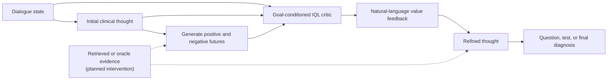
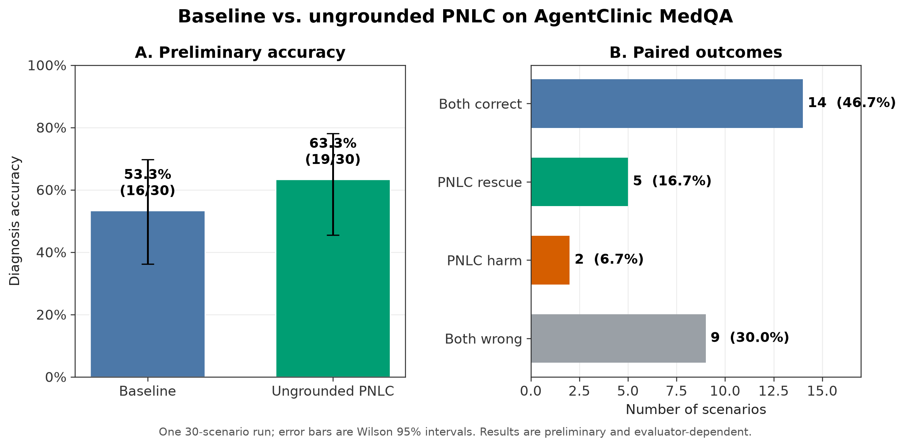
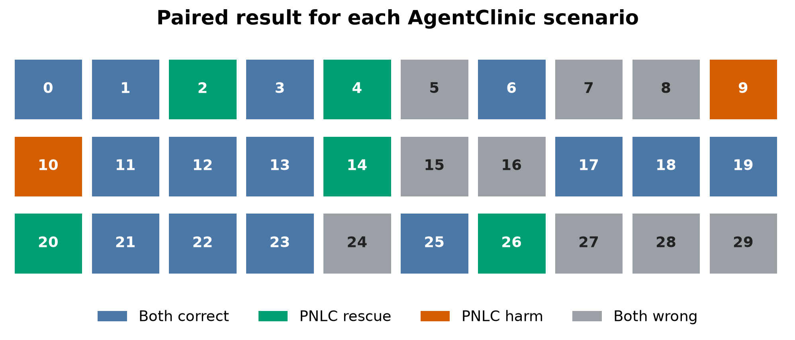

# Do Trained Critics Correct or Inherit Generator Failures?

### Retrieval-grounded natural-language critics for knowledge-heavy agents

This repository contains the experimental testbed for studying a structural weakness in
critic-assisted language agents: a critic can only evaluate the futures that its generator is able
to imagine. When those futures contain the same missing knowledge, false assumptions, or
hallucinated evidence as the acting model, critic feedback may reinforce the error instead of
correcting it.

The first study uses multi-turn clinical diagnosis in
[AgentClinic](https://arxiv.org/abs/2405.07960). The planning loop follows the natural-language
critic formulation introduced by [PNLC](https://arxiv.org/abs/2505.18098), with a
goal-conditioned IQL critic trained from relabelled dialogue trajectories.

> **Status:** preliminary Stage 1 results. The baseline and ungrounded PNLC conditions have been
> run on 30 AgentClinic MedQA scenarios. Retrieval and oracle interventions have not yet been run,
> so the current results identify candidate failure mechanisms rather than demonstrating that
> retrieval fixes them.

## Abstract

Language-model agents increasingly use generated future outcomes as an interface between planning
and learned value functions. This works only if the generated futures preserve the facts needed to
evaluate the action. We investigate what happens when that assumption fails in knowledge-heavy
interactive environments.

Our central hypothesis is that an ungrounded natural-language critic can inherit the generator's
knowledge failures because its value model scores descriptions rather than independently verifying
their factual content. We test this in clinical diagnosis by comparing an unaided doctor agent with
an IQL-critic-assisted PNLC agent, then inspecting paired trajectories to locate the first decisive
error. Planned interventions replay those states with retrieved or oracle evidence to determine
whether the failure comes from imagination, retrieval, evidence use, or downstream reasoning.

## Research questions

| Question | Experimental target |
|---|---|
| **RQ1 — Does an ungrounded critic help?** | Compare diagnosis accuracy and paired scenario transitions between the baseline doctor and PNLC. |
| **RQ2 — What does the critic inherit?** | Separate missing medical knowledge from elicitation, reasoning, interaction-loop, and evaluation failures. |
| **RQ3 — Where should retrieval enter?** | Ground the doctor, future generator, refinement stage, or both while holding the saved decision state fixed. |
| **RQ4 — Does the mechanism generalise?** | Repeat the causal intervention across generator models and a non-medical knowledge-heavy domain. |

## Method

The doctor first proposes a private reasoning step. The same generator imagines productive and
harmful future states. A goal-conditioned IQL critic estimates how reachable each future is from the
current state and proposed thought. Those values are translated back into natural-language feedback
for one refinement round before the doctor acts.


```mermaid
flowchart LR
    S["Dialogue state"] --> T["Initial clinical thought"]
    T --> G["Generate positive and negative futures"]
    S --> C["Goal-conditioned IQL critic"]
    T --> C
    G --> C
    C --> V["Natural-language value feedback"]
    V --> R["Refined thought"]
    R --> A["Question, test, or final diagnosis"]
    K["Retrieved or oracle evidence\n(planned intervention)"] -.-> G
    K -.-> R
```

The failure of interest is not simply an incorrect diagnosis. It is the more specific sequence:

1. A required fact is absent, contradicted, or invented in an imagined future.
2. The critic assigns value without detecting that factual defect.
3. Refinement preserves or amplifies the mistaken belief.
4. Supplying the missing evidence at the same decision state changes the preferred thought or
   action.

The fourth step is the causal test and remains future work.

## Experimental setting

| Component | Stage 1 setting |
|---|---|
| Environment | AgentClinic, first 30 MedQA clinical scenarios |
| Interaction budget | Up to 20 doctor turns per scenario |
| Baseline | Doctor agent without critic refinement |
| PNLC condition | Two positive and two negative futures, one refinement round |
| Critic | Goal-conditioned IQL value model over state, thought, and future embeddings |
| Outcome | Final-diagnosis equivalence judged by the configured model-based moderator |
| Analysis | Paired by scenario index; full trajectories retained for mechanism review |

The baseline and PNLC runs use the same ordered scenarios, but the conversations are stochastic.
Consequently, a paired transition identifies a case for review; it does not alone prove that the
critic caused the change.

## Preliminary results



The baseline solves 16 of 30 scenarios (53.3%) and ungrounded PNLC solves 19 of 30 (63.3%). PNLC
rescues five baseline failures and fails on two scenarios that the baseline solves, for a net change
of three cases.

| Paired outcome | Scenarios | Share |
|---|---:|---:|
| Both correct | 14 | 46.7% |
| PNLC rescue | 5 | 16.7% |
| PNLC harm | 2 | 6.7% |
| Both wrong | 9 | 30.0% |

This difference is not statistically persuasive at the current sample size: the seven discordant
pairs give an exact two-sided McNemar test of approximately p = 0.45. More importantly, moderator
errors have been identified during manual review, so these numbers should be treated as descriptive
until the evaluation labels are adjudicated.



## Evidence of the proposed weakness

Trajectory inspection shows that the aggregate improvement hides several cases where generated
futures contradict the observed record or introduce unsupported findings.

| Scenario | Logged behaviour | Candidate mechanism |
|---:|---|---|
| 5 | MRI reports no meniscal tear, but an imagined harmful future warns that a tear was missed; refinement ends with a meniscal-tear diagnosis. | Counterfactual future contradicts observed evidence. |
| 8 | The doctor initially identifies a phyllodes tumour after the characteristic biopsy result, but the loop delays commitment and later treats the same finding as fibroadenoma. | Correct hypothesis lost because futures inherit incorrect medical interpretation. |
| 9 | The episiotomy is reported as healing without redness or discharge, while generated futures assume inflammation and culture confirmation; PNLC changes a baseline-correct endometritis case into episiotomy infection. | Unsupported future findings produce critic-associated harm. |
| 27 | The returned MRI is normal, while imagined futures state that MRI confirmed rotator-cuff tendinitis or bursitis. | Hallucinated test interpretation reinforces the wrong diagnosis. |
| 28 | The agent focuses on polydipsia and the intermediate hyponatraemia finding without recovering the intended underlying cause. | Failure to connect laboratory evidence, risk factors, and causal diagnosis. |
| 29 | The loop anchors on a camping history and imagines confirmation of a tick-borne disease while neglecting the discriminative joint, skin, and sexual-history evidence. | A plausible distractor dominates future generation. |

These trajectories support the limited claim that **ungrounded PNLC futures can preserve factual
errors and can fail to correct—or occasionally worsen—the doctor's decision**. They do not yet
support the stronger claim that retrieval grounding resolves the problem.

Other failures have different explanations and are kept separate:

- Scenario 10 is primarily an interaction-loop failure: PNLC repeatedly restarts the same physical
  examination.
- Scenario 15 ends with an underspecified cyst diagnosis rather than a clearly different disease.
- Scenario 16 gives an essentially correct C. difficile diagnosis that the moderator marks
  incorrect.
- Manual review also found questionable positive moderator decisions in scenarios 3 and 14.

## Planned causal evaluation

The next experiment starts from saved decision states rather than rerunning an entire stochastic
consultation.

| Arm | Doctor evidence | Future/refinement evidence | Purpose |
|---|---|---|---|
| Baseline replay | None | No critic | Preserve the original decision point. |
| Ungrounded PNLC | None | None | Reproduce the candidate failure. |
| Doctor-only retrieval | Retrieved | None | Test whether correcting the actor is sufficient. |
| Critic-loop retrieval | None | Retrieved | Test whether grounded futures can correct an ungrounded actor. |
| Fully grounded | Retrieved | Retrieved | Measure the combined intervention. |
| Oracle evidence | None | Curated relevant fact | Establish whether the failure is knowledge-correctable at all. |

The oracle supplies the relevant medical fact, not the answer label. The primary cases for this
replay are scenarios **5, 8, 9, 27, 28, and 29**.

After the fixed-state experiment, the full evaluation will:

1. adjudicate all moderator labels with blinded human review;
2. repeat each condition across multiple stochastic runs;
3. report paired confidence intervals and error-category agreement;
4. evaluate at least two doctor models;
5. replicate the mechanism in a non-medical domain.

The current leading second-domain candidate is **IT incident diagnosis/SRE**, where the hidden state
is a system fault, actions inspect logs or run tests, retrieval comes from runbooks and technical
documentation, and success can be measured by root-cause identification and service recovery.

## Reproducing the study

### Environment

```bash
conda activate pnlc
pip install -e ".[analysis]"
```

Generation and embedding backends are independent Hydra configuration groups. OpenAI-compatible
endpoints and local Hugging Face models can therefore be mixed without changing the experimental
code.

### 1. Run the baseline

```bash
python scripts/run_stage1_baseline.py \
  model_backends.base_url=https://your-doctor-endpoint/v1 \
  moderator=openai-compatible \
  moderator.base_url=https://your-evaluator-endpoint/v1 \
  moderator.model_name=your-evaluator-model
```

### 2. Build the critic dataset and train

```bash
python scripts/run_embed_dataset.py \
  model_backends=hf-generation \
  model_backends.model_name=Qwen/Qwen2.5-0.5B-Instruct \
  embedding=hf-embed \
  embedding.model_name=sentence-transformers/all-MiniLM-L6-v2

python scripts/run_relabel_dataset.py
python scripts/train_critic.py --input /path/to/stage1_relabeled_RUN_ID.npz
```

The embedding model used at inference must match the model used to construct the critic-training
dataset.

### 3. Run ungrounded PNLC

```bash
python scripts/run_pnlc_agentclinic.py \
  critic.checkpoint=/path/to/iql_critic.pt \
  critic.num_scenarios=30 \
  model_backends.base_url=https://your-doctor-endpoint/v1 \
  embedding=hf-embed \
  embedding.model_name=sentence-transformers/all-MiniLM-L6-v2 \
  moderator=openai-compatible \
  moderator.base_url=https://your-evaluator-endpoint/v1 \
  moderator.model_name=your-evaluator-model
```

### 4. Analyse paired trajectories

Open `notebook/data_diagnostic.ipynb`, select the intended baseline and PNLC result files in the
“Paired baseline–PNLC outcome analysis” section, and run the remaining cells. The notebook generates
the paired tables, failure-review queue, scenario inspection helper, and the figures embedded above.

## Research artifacts

| Artifact | Role in the study |
|---|---|
| `logs/stage1_baseline_*.json` | Final baseline diagnoses and moderator decisions |
| `logs/stage1_trajectories_*.json` | Baseline turn-level reasoning and actions |
| `logs/stage1_pnlc_results_*.json` | Final critic-assisted diagnoses and decisions |
| `logs/stage1_pnlc_trajectories_*.json` | Generated futures, critic scores, refinements, and actions |
| `notebook/data_diagnostic.ipynb` | Paired quantitative analysis and qualitative review |
| `docs/figures/` | Figures generated from the selected result logs |

## Current limitations

- The reported sample contains only 30 scenarios and one run per condition.
- Scenario IDs are paired, but the underlying conversations are stochastic rather than transcript
  controlled.
- The moderator is not yet a reliable gold-standard evaluator.
- Critic outputs are used as relative value signals; their probability calibration has not been
  established.
- The current critic and generator operate without retrieved evidence.
- The present evidence comes from one clinical benchmark and cannot yet support a cross-domain
  claim.

## References

- Schmidgall et al. [AgentClinic: a multimodal agent benchmark to evaluate AI in simulated clinical
  environments](https://arxiv.org/abs/2405.07960), 2024.
- Hong, Dragan, and Levine. [Planning without Search: Refining Frontier LLMs with Offline
  Goal-Conditioned RL](https://arxiv.org/abs/2505.18098), NeurIPS 2025.

## Licence

The project code is released under the licence in [LICENSE](LICENSE). The vendored AgentClinic
benchmark retains its original licence and attribution.
