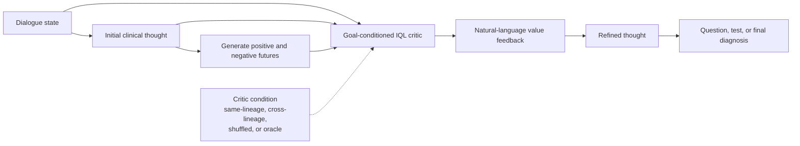
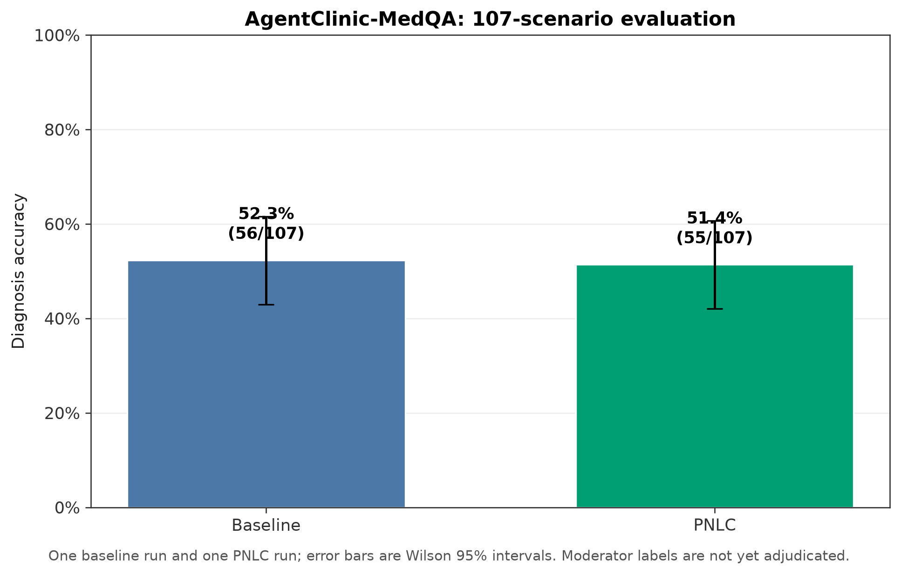
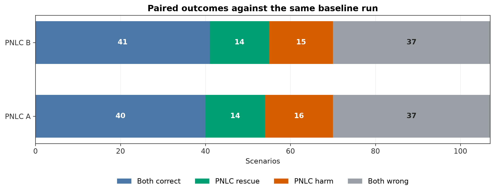
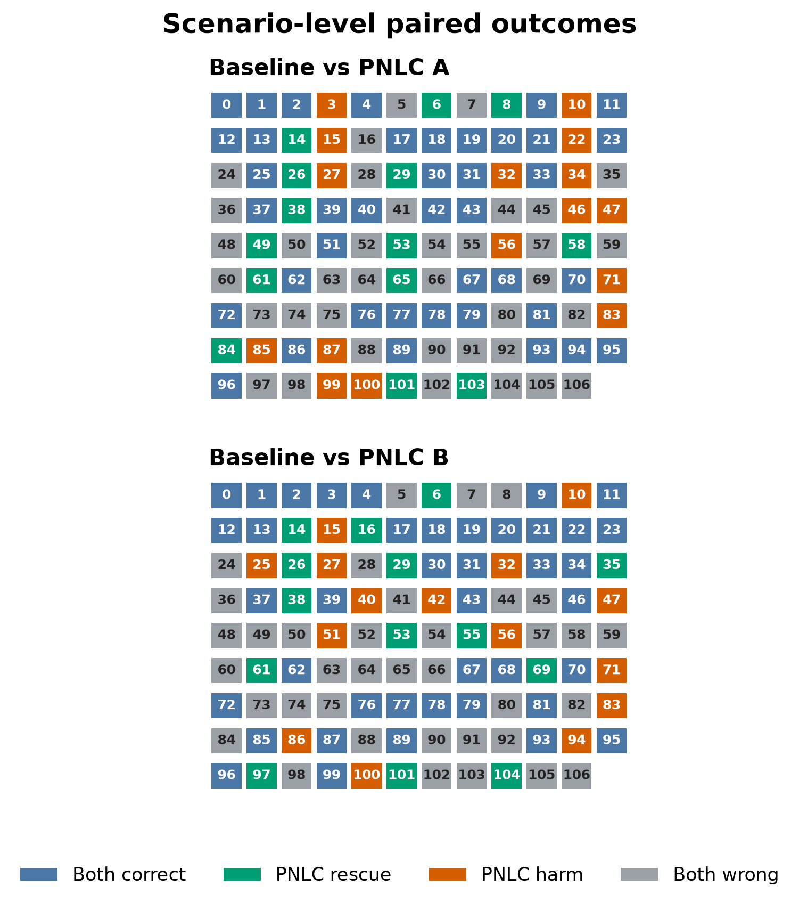
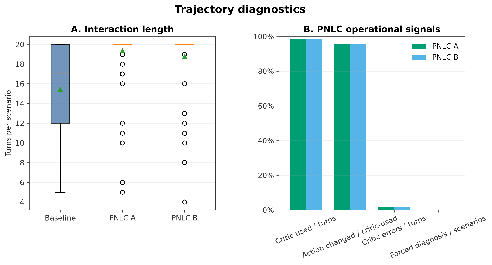

# Do Trained Critics Correct or Inherit Generator Failures?

### Correction, corruption, and error inheritance in knowledge-heavy agents

This repository contains the experimental testbed for studying a structural weakness in
critic-assisted language agents: a critic can only evaluate the futures that its generator is able
to imagine. When those futures contain the same missing knowledge, false assumptions, or
hallucinated evidence as the acting model, critic feedback may reinforce the error instead of
correcting it.

The first study uses multi-turn clinical diagnosis in
[AgentClinic](https://arxiv.org/abs/2405.07960). The planning loop follows the natural-language
critic formulation introduced by [PNLC](https://arxiv.org/abs/2505.18098), with a
goal-conditioned IQL critic trained from relabelled dialogue trajectories.

> **Status:** ICLR workshop study in progress. One 107-scenario AgentClinic–MedQA baseline and one
> trained-critic PNLC run are complete. Independent re-evaluation reverses the weak Qwen
> moderator's one-case baseline advantage, but the paired difference remains non-significant.
> The next stage tests when critic feedback corrects, corrupts, or inherits generator errors through
> matched-seed replication and fixed-state causal replay.

## Abstract

Language-model agents increasingly use generated future outcomes as an interface between planning
and learned value functions. This works only if the generated futures preserve the facts needed to
evaluate the action. We investigate what happens when that assumption fails in knowledge-heavy
interactive environments.

Across all 107 AgentClinic–MedQA scenarios, the original Qwen moderator scores the baseline at
52.3% and PNLC at 51.4%. A stricter independent audit instead scores them at 47.7% and 52.3%;
accepting every borderline semantic match gives 52.3% and 53.3%. None of these paired comparisons
establishes a significant aggregate advantage. The robust observation is that critic feedback
produces both corrections and corruptions, while adding interaction cost.

Our central hypothesis is that an outcome-trained natural-language critic is not automatically an
independent verifier. When its targets and inference-time goals are constructed from generator
rollouts, it may score plausible descriptions that reproduce the generator's own blind spots. We
test this by separating correction from corruption, replaying identical saved states while swapping
only the critic, and comparing same-generator, cross-generator, shuffled-score, and oracle-evidence
conditions. A complete retrieval system is outside the workshop paper's scope.

## Research questions

| Question | Experimental target |
|---|---|
| **RQ1 — Net effect** | How often does refinement correct an initially wrong decision versus corrupt an initially correct one? |
| **RQ2 — Inheritance** | Do critic-preferred errors overlap more strongly with errors from the generator family used to construct critic data? |
| **RQ3 — Causality** | At an identical saved state and candidate-future pool, does swapping only the critic change the action and outcome? |
| **RQ4 — Correctability and generality** | Does a short oracle fact reduce inherited errors, and does the pattern reproduce across seeds and an additional open-model family? |

## Method

The doctor first proposes a private reasoning step. The same generator imagines productive and
harmful future states. A goal-conditioned IQL critic estimates how reachable each future is from the
current state and proposed thought. Those values are translated back into natural-language feedback
for one refinement round before the doctor acts.


```mermaid
flowchart LR
    S["Dialogue state"] --> T["Initial clinical thought"]
    T --> G["Generate positive and negative futures"]
    S --> C["Goal-conditioned IQL critic"]
    T --> C
    G --> C
    C --> V["Natural-language value feedback"]
    V --> R["Refined thought"]
    R --> A["Question, test, or final diagnosis"]
    X["Critic condition\nsame-lineage, cross-lineage,\nshuffled, or oracle"] -.-> C
```

The failure of interest is not simply an incorrect diagnosis. It is the more specific sequence:

1. The generator proposes an initially correct or incorrect decision.
2. Generated futures omit, contradict, or invent task-relevant evidence.
3. The trained critic assigns value without reliably detecting the defect.
4. Refinement either corrects the initial error or corrupts a correct decision.
5. Holding the state and future candidates fixed while swapping the critic changes that outcome.

The fifth step is the causal inheritance test and remains future work.

## Experimental setting

| Component | Stage 1 setting |
|---|---|
| Environment | AgentClinic, all 107 MedQA clinical scenarios |
| Interaction budget | Up to 20 doctor turns per scenario |
| Baseline | Doctor agent without critic refinement |
| PNLC condition | Two positive and two negative futures, one refinement round |
| Critic | Goal-conditioned IQL value model over state, thought, and future embeddings |
| Outcome | Final-diagnosis equivalence under the benchmark moderator plus independent strict and borderline-sensitive adjudication |
| Runs | One retained baseline run and one retained PNLC run |
| Analysis | Paired by validated source scenario; full trajectories retained for mechanism review |

The baseline and PNLC runs use the same ordered scenarios, but the conversations are stochastic.
Consequently, a paired transition identifies a case for review; it does not alone prove that the
critic caused the change.

## Stage 1 results: evaluator-sensitive motivation evidence



| Evaluation | Baseline | PNLC |
|---|---:|---:|
| Original Qwen moderator | 56 / 107 (52.3%) | 55 / 107 (51.4%) |
| Independent strict adjudication | 51 / 107 (47.7%) | 56 / 107 (52.3%) |
| Lenient borderline sensitivity | 56 / 107 (52.3%) | 57 / 107 (53.3%) |

The independent strict adjudication produces the following paired transitions:

| Comparison | Both correct | PNLC rescue | PNLC harm | Both wrong | Exact McNemar p |
|---|---:|---:|---:|---:|---:|
| Baseline vs PNLC | 42 | 14 | 9 | 42 | 0.405 |



The 9 strict PNLC harm candidates are scenarios **6, 10, 25, 27, 32, 40, 83, 86, and 94**. The
14 strict PNLC rescues are scenarios **3, 16, 26, 29, 34, 35, 38, 53, 55, 61, 69, 97, 101, and
104**. Harms, rescues, both-correct controls, and both-wrong controls form the fixed-state replay
set.



The embedded figures currently visualise the original Qwen moderator labels and must be regenerated
after replicated runs. The critic is used on approximately 98.5% of PNLC turns and changes the
action text on about 95.9% of critic-used turns, yet PNLC conversations remain close to the 20-turn
budget. The critic is therefore influential, but its aggregate benefit remains unresolved.



### What these results establish

- The weak moderator changes important labels and cannot carry the primary result.
- Independent adjudication places PNLC slightly ahead, but the paired difference is not significant.
- Critic refinement produces both corrections and corruptions.
- PNLC adds interaction cost despite the critic being active on nearly every turn.
- Several trajectories contain explicit correct-before-critic states followed by unsupported
  refinement, making fixed-state replay scientifically justified.

### What remains unproven

- Whether corrections and corruptions reproduce across matched seeds.
- Whether critic errors systematically inherit a generator-family-specific error distribution.
- Whether the critic causes the action change rather than merely accompanying a different
  stochastic conversation.
- Whether an independently trained critic or oracle fact changes future ranking and action at the
  same decision state.
- Whether the mechanism generalises beyond the current Qwen-class generator.

The paper's mechanism is confirmed only when a fixed-state experiment demonstrates **generator
error pattern → same-lineage critic acceptance → inherited or amplified refinement**, and critic
lineage or oracle evidence changes that chain.

## Planned causal evaluation

The next experiment starts from saved decision states and reuses one shared candidate-future pool.

| Arm | What changes | Purpose |
|---|---|---|
| No critic | Refinement is removed | Establish the saved-state generator decision |
| Shuffled-score control | Critic scores are permuted | Test whether any extra feedback changes behaviour |
| Same-lineage critic | Current trained critic | Measure correction and inherited corruption |
| Cross-lineage critic | Critic data come from another generator family | Test generator-specific error inheritance |
| Oracle scorer/fact | One curated non-answer fact informs scoring | Test whether the failure is knowledge-correctable |

Each replay keeps the dialogue state, initial thought, candidate futures, token budget, and decoding
configuration fixed. Use at least five samples per state and include harms, rescues, and matched
controls.

The revised research plan is:

1. **Repair the measurement layer — complete for future runs.** The result logger now emits one
   source-keyed row per scenario, including explicit no-diagnosis failures.
2. **Lock evaluation.** Use the written equivalence rubric, blinded adjudication, and borderline
   sensitivity analysis.
3. **Replicate end to end.** Reach at least three matched seeds for baseline and PNLC.
4. **Run fixed-state replay.** Compare no critic, shuffled scores, same-lineage critic,
   cross-lineage critic, and oracle grounding.
5. **Measure inheritance.** Quantify correction, corruption, preservation, error-cluster overlap,
   critic discrimination, and action reversal.
6. **Test model generality.** Repeat the core experiment with one additional open-model family, or
   explicitly restrict the paper's claim to Qwen-7B.

The complete workshop plan is in
[`docs/proposals/critic_inheritance_iclr_workshop_plan.md`](docs/proposals/critic_inheritance_iclr_workshop_plan.md).
Full retrieval and cross-domain replication are follow-up projects rather than submission gates.

## Reproducing the study

### Environment

```bash
conda activate pnlc
pip install -e ".[analysis]"
```

Generation and embedding backends are independent Hydra configuration groups. OpenAI-compatible
endpoints and local Hugging Face models can therefore be mixed without changing the experimental
code.

### 1. Run the baseline

```bash
python scripts/run_stage1_baseline.py \
  seed=11 \
  num_scenarios=107 \
  model_backends.base_url=https://your-doctor-endpoint/v1 \
  moderator=openai-compatible \
  moderator.base_url=https://your-evaluator-endpoint/v1 \
  moderator.model_name=your-evaluator-model
```

### 2. Build the critic dataset and train

```bash
python scripts/run_embed_dataset.py \
  model_backends=hf-generation \
  model_backends.model_name=Qwen/Qwen2.5-0.5B-Instruct \
  embedding=hf-embed \
  embedding.model_name=sentence-transformers/all-MiniLM-L6-v2

python scripts/run_relabel_dataset.py
python scripts/train_critic.py --input /path/to/stage1_relabeled_RUN_ID.npz
```

The embedding model used at inference must match the model used to construct the critic-training
dataset.

### 3. Run ungrounded PNLC

```bash
python scripts/run_pnlc_agentclinic.py \
  seed=11 \
  critic.checkpoint=/path/to/iql_critic.pt \
  num_scenarios=107 \
  model_backends.base_url=https://your-doctor-endpoint/v1 \
  embedding=hf-embed \
  embedding.model_name=sentence-transformers/all-MiniLM-L6-v2 \
  moderator=openai-compatible \
  moderator.base_url=https://your-evaluator-endpoint/v1 \
  moderator.model_name=your-evaluator-model
```

Use the same seed for each baseline–PNLC pair, then repeat the pair with two more seeds (for
example, `11`, `22`, and `33`). The runner seeds Python, NumPy, PyTorch, local Hugging Face
sampling, and the OpenAI-compatible request. Every saved result and trajectory row records the
value as `run_seed`. A hosted endpoint must support the OpenAI-compatible `seed` parameter for
deterministic generation; if it ignores that parameter, the run is not fully reproducible even
though the local parts are seeded.

### 4. Analyse paired trajectories

Open `notebook/agentclinic_107_analysis.ipynb`. It validates the 107-case roster, repairs shifted
result IDs from the trajectory order, analyses the retained baseline and PNLC runs, exports the
failure-review queue, and generates the figures embedded above.

## Research artifacts

| Artifact | Role in the study |
|---|---|
| `logs/stage1_baseline_*.json` | Final baseline diagnoses and moderator decisions |
| `logs/stage1_trajectories_*.json` | Baseline turn-level reasoning and actions |
| `logs/stage1_pnlc_results_*.json` | Final critic-assisted diagnoses and decisions |
| `logs/stage1_pnlc_trajectories_*.json` | Generated futures, critic scores, refinements, and actions |
| `notebook/agentclinic_107_analysis.ipynb` | Complete 107-scenario validation, paired analysis, plots, and review queues |
| `docs/analysis/` | Accuracy, trajectory, paired-outcome, and failure-review tables |
| `docs/figures/` | Figures generated from the selected result logs |

## Current limitations

- The full 107 scenarios are covered, but there is only one retained run per condition.
- Scenario IDs are paired, but the underlying conversations are stochastic rather than transcript
  controlled.
- The Qwen moderator is not a reliable gold-standard evaluator; independent adjudication changes
  the direction of the point estimate.
- The retained historical baseline file still has the original 106-row logging defect, so the
  analysis notebook repairs its alignment. New runs use immutable source IDs and explicit
  `no_diagnosis` rows.
- Critic outputs are used as relative value signals; their probability calibration has not been
  established.
- The current critic and generator operate without independent evidence, and critic inheritance has
  not yet been isolated from stochastic trajectory divergence.
- The complete trajectory set has not yet received blinded failure-mode adjudication.
- The present evidence comes from one Qwen-class generator and one clinical benchmark; the workshop
  claim must remain scoped unless the additional open-model experiment succeeds.

## References

- Schmidgall et al. [AgentClinic: a multimodal agent benchmark to evaluate AI in simulated clinical
  environments](https://arxiv.org/abs/2405.07960), 2024.
- Hong, Dragan, and Levine. [Planning without Search: Refining Frontier LLMs with Offline
  Goal-Conditioned RL](https://arxiv.org/abs/2505.18098), NeurIPS 2025.

## Licence

The project code is released under the licence in [LICENSE](LICENSE). The vendored AgentClinic
benchmark retains its original licence and attribution.
