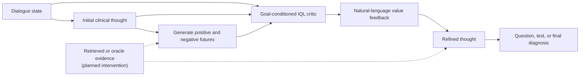

# Do Trained Critics Correct or Inherit Generator Failures?

### Retrieval-grounded natural-language critics for knowledge-heavy agents

This repository contains the experimental testbed for studying a structural weakness in
critic-assisted language agents: a critic can only evaluate the futures that its generator is able
to imagine. When those futures contain the same missing knowledge, false assumptions, or
hallucinated evidence as the acting model, critic feedback may reinforce the error instead of
correcting it.

The first study uses multi-turn clinical diagnosis in
[AgentClinic](https://arxiv.org/abs/2405.07960). The planning loop follows the natural-language
critic formulation introduced by [PNLC](https://arxiv.org/abs/2505.18098), with a
goal-conditioned IQL critic trained from relabelled dialogue trajectories.

> **Status:** Stage 1 motivation gate passed. The full 107-scenario AgentClinic–MedQA evaluation
> contains one baseline run and two ungrounded PNLC runs. PNLC does not improve aggregate accuracy,
> produces nearly balanced rescues and harms, and increases interaction length. This establishes a
> reproducible weakness worth investigating; it does **not** yet establish that ungrounded futures
> cause the weakness or that retrieval repairs it. Trajectory adjudication and oracle replay are
> the next causal tests.

## Abstract

Language-model agents increasingly use generated future outcomes as an interface between planning
and learned value functions. This works only if the generated futures preserve the facts needed to
evaluate the action. We investigate what happens when that assumption fails in knowledge-heavy
interactive environments.

Across all 107 AgentClinic–MedQA scenarios, one baseline run reaches 52.3% accuracy while two
ungrounded PNLC runs reach 50.5% and 51.4%. PNLC also increases mean interaction length and produces
nine repeatable harm cases across both critic-assisted runs. These findings establish the weakness
to be explained, not its cause.

Our central hypothesis is that an ungrounded natural-language critic can inherit the generator's
knowledge failures because its value model scores descriptions rather than independently verifying
their factual content. We test this in clinical diagnosis by comparing an unaided doctor agent with
an IQL-critic-assisted PNLC agent, then inspecting paired trajectories to locate the first decisive
error. Planned interventions replay those states with retrieved or oracle evidence to determine
whether the failure comes from imagination, retrieval, evidence use, or downstream reasoning.

## Research questions

| Question | Experimental target |
|---|---|
| **RQ1 — Does an ungrounded critic help?** | Compare diagnosis accuracy and paired scenario transitions between the baseline doctor and PNLC. |
| **RQ2 — What does the critic inherit?** | Separate missing medical knowledge from elicitation, reasoning, interaction-loop, and evaluation failures. |
| **RQ3 — Where should retrieval enter?** | Ground the doctor, future generator, refinement stage, or both while holding the saved decision state fixed. |
| **RQ4 — Does the mechanism generalise?** | Repeat the causal intervention across generator models and a non-medical knowledge-heavy domain. |

## Method

The doctor first proposes a private reasoning step. The same generator imagines productive and
harmful future states. A goal-conditioned IQL critic estimates how reachable each future is from the
current state and proposed thought. Those values are translated back into natural-language feedback
for one refinement round before the doctor acts.


```mermaid
flowchart LR
    S["Dialogue state"] --> T["Initial clinical thought"]
    T --> G["Generate positive and negative futures"]
    S --> C["Goal-conditioned IQL critic"]
    T --> C
    G --> C
    C --> V["Natural-language value feedback"]
    V --> R["Refined thought"]
    R --> A["Question, test, or final diagnosis"]
    K["Retrieved or oracle evidence\n(planned intervention)"] -.-> G
    K -.-> R
```

The failure of interest is not simply an incorrect diagnosis. It is the more specific sequence:

1. A required fact is absent, contradicted, or invented in an imagined future.
2. The critic assigns value without detecting that factual defect.
3. Refinement preserves or amplifies the mistaken belief.
4. Supplying the missing evidence at the same decision state changes the preferred thought or
   action.

The fourth step is the causal test and remains future work.

## Experimental setting

| Component | Stage 1 setting |
|---|---|
| Environment | AgentClinic, all 107 MedQA clinical scenarios |
| Interaction budget | Up to 20 doctor turns per scenario |
| Baseline | Doctor agent without critic refinement |
| PNLC condition | Two positive and two negative futures, one refinement round |
| Critic | Goal-conditioned IQL value model over state, thought, and future embeddings |
| Outcome | Final-diagnosis equivalence judged by the configured model-based moderator |
| Runs | One baseline run and two independent PNLC runs |
| Analysis | Paired by validated source scenario; full trajectories retained for mechanism review |

The baseline and PNLC runs use the same ordered scenarios, but the conversations are stochastic.
Consequently, a paired transition identifies a case for review; it does not alone prove that the
critic caused the change.

## Stage 1 results: the weakness is reproducible


| Run | Correct | Accuracy | Mean turns |
|---|---:|---:|---:|
| Baseline | 56 / 107 | 52.3% | 15.46 |
| PNLC A | 54 / 107 | 50.5% | 19.35 |
| PNLC B | 55 / 107 | 51.4% | 18.79 |

PNLC does not improve aggregate diagnosis accuracy in either run. The paired transitions are also
nearly balanced:

| Comparison | Both correct | PNLC rescue | PNLC harm | Both wrong | Exact McNemar p |
|---|---:|---:|---:|---:|---:|
| Baseline vs PNLC A | 40 | 14 | 16 | 37 | 0.856 |
| Baseline vs PNLC B | 41 | 14 | 15 | 37 | 1.000 |


The two PNLC runs agree on correctness for 82 of 107 scenarios (76.6%). Nine scenarios are PNLC
harms in both runs: **10, 15, 27, 32, 47, 56, 71, 83, and 100**. A further 31 scenarios are wrong
under the baseline and both PNLC runs. These stable sets are the highest-priority trajectory audit
and oracle-replay cases.


The critic is used on approximately 98.6% of PNLC turns and changes the action text on about 96% of
critic-used turns, yet PNLC conversations remain close to the 20-turn budget. This shows that the
critic is operational and influential without being reliably beneficial.


### What these results establish

- The ungrounded critic does not provide a robust accuracy benefit in this knowledge-heavy setting.
- Critic refinement introduces reproducible harms as well as rescues.
- PNLC adds interaction cost and exhibits substantial stochastic outcome instability.
- The failure is therefore scientifically worth explaining.

### What remains unproven

- Whether the stable harms are caused by unsupported or contradictory imagined futures.
- Whether the critic prefers those defective futures rather than merely accompanying the failure.
- Whether oracle evidence changes the future ranking and next action at the same decision state.
- Whether real retrieval closes the gap to the oracle.

The paper's mechanism is confirmed only when the trajectory audit demonstrates **defective future →
critic acceptance → harmful refinement**, and the fixed-state oracle intervention reverses that
chain.

## Planned causal evaluation

The next experiment starts from saved decision states rather than rerunning an entire stochastic
consultation.

| Arm | Doctor evidence | Future/refinement evidence | Purpose |
|---|---|---|---|
| Baseline replay | None | No critic | Preserve the original decision point. |
| Ungrounded PNLC | None | None | Reproduce the candidate failure. |
| Doctor-only retrieval | Retrieved | None | Test whether correcting the actor is sufficient. |
| Critic-loop retrieval | None | Retrieved | Test whether grounded futures can correct an ungrounded actor. |
| Fully grounded | Retrieved | Retrieved | Measure the combined intervention. |
| Oracle evidence | None | Curated relevant fact | Establish whether the failure is knowledge-correctable at all. |

The oracle supplies the relevant medical fact, not the answer label. Begin with the nine harms that
repeat across both PNLC runs—**10, 15, 27, 32, 47, 56, 71, 83, and 100**—then add matched stable
both-wrong cases and successful controls. Each replay keeps the saved state, proposed thought,
generation budget, and critic checkpoint fixed.

The revised research plan is:

1. **Repair the measurement layer.** Adjudicate moderator labels and fix the result logger so a
   non-diagnosis cannot shift later scenario IDs.
2. **Audit the stable cases.** Mark the first decisive turn and label future defects, critic
   preference, refinement changes, operational failures, and evaluator disagreements.
3. **Run the oracle probe.** Compare no evidence, irrelevant matched-length evidence, retrieved
   evidence, and clinician-selected oracle evidence with at least five generations per state.
4. **Test the causal chain.** Measure future factuality, critic ranking, action reversal, and
   realised task outcome.
5. **Scale only after the oracle gate.** If oracle evidence repairs the target failures, run the
   retrieval-placement arms end to end; otherwise reclassify the mechanism.
6. **Complete generality tests.** Reach at least three runs per main condition, evaluate a second
   open-model family, and replicate the mechanism in a non-medical domain.

The current leading second-domain candidate is **IT incident diagnosis/SRE**, where the hidden state
is a system fault, actions inspect logs or run tests, retrieval comes from runbooks and technical
documentation, and success can be measured by root-cause identification and service recovery.

## Reproducing the study

### Environment

```bash
conda activate pnlc
pip install -e ".[analysis]"
```

Generation and embedding backends are independent Hydra configuration groups. OpenAI-compatible
endpoints and local Hugging Face models can therefore be mixed without changing the experimental
code.

### 1. Run the baseline

```bash
python scripts/run_stage1_baseline.py \
  num_scenarios=107 \
  model_backends.base_url=https://your-doctor-endpoint/v1 \
  moderator=openai-compatible \
  moderator.base_url=https://your-evaluator-endpoint/v1 \
  moderator.model_name=your-evaluator-model
```

### 2. Build the critic dataset and train

```bash
python scripts/run_embed_dataset.py \
  model_backends=hf-generation \
  model_backends.model_name=Qwen/Qwen2.5-0.5B-Instruct \
  embedding=hf-embed \
  embedding.model_name=sentence-transformers/all-MiniLM-L6-v2

python scripts/run_relabel_dataset.py
python scripts/train_critic.py --input /path/to/stage1_relabeled_RUN_ID.npz
```

The embedding model used at inference must match the model used to construct the critic-training
dataset.

### 3. Run ungrounded PNLC

```bash
python scripts/run_pnlc_agentclinic.py \
  critic.checkpoint=/path/to/iql_critic.pt \
  num_scenarios=107 \
  model_backends.base_url=https://your-doctor-endpoint/v1 \
  embedding=hf-embed \
  embedding.model_name=sentence-transformers/all-MiniLM-L6-v2 \
  moderator=openai-compatible \
  moderator.base_url=https://your-evaluator-endpoint/v1 \
  moderator.model_name=your-evaluator-model
```

### 4. Analyse paired trajectories

Open `notebook/agentclinic_107_analysis.ipynb`. It validates the 107-case roster, repairs shifted
result IDs from the trajectory order, analyses both PNLC runs, exports failure-review queues, and
generates the figures embedded above.

## Research artifacts

| Artifact | Role in the study |
|---|---|
| `logs/stage1_baseline_*.json` | Final baseline diagnoses and moderator decisions |
| `logs/stage1_trajectories_*.json` | Baseline turn-level reasoning and actions |
| `logs/stage1_pnlc_results_*.json` | Final critic-assisted diagnoses and decisions |
| `logs/stage1_pnlc_trajectories_*.json` | Generated futures, critic scores, refinements, and actions |
| `notebook/agentclinic_107_analysis.ipynb` | Complete 107-scenario validation, paired analysis, plots, and review queues |
| `docs/analysis/` | Accuracy, trajectory, paired-outcome, and failure-review tables |
| `docs/figures/` | Figures generated from the selected result logs |

## Current limitations

- The full 107 scenarios are covered, but there is only one baseline run and two PNLC runs.
- Scenario IDs are paired, but the underlying conversations are stochastic rather than transcript
  controlled.
- The moderator is not yet a reliable gold-standard evaluator.
- The current result logger records the number of completed diagnoses rather than the active source
  scenario. The analysis notebook repairs this from terminal trajectory IDs and benchmark
  references; the logger must be fixed before new experiments.
- Critic outputs are used as relative value signals; their probability calibration has not been
  established.
- The current critic and generator operate without retrieved evidence.
- The complete trajectory set has not yet received blinded failure-mode adjudication.
- The present evidence comes from one clinical benchmark and cannot yet support a cross-domain
  claim.

## References

- Schmidgall et al. [AgentClinic: a multimodal agent benchmark to evaluate AI in simulated clinical
  environments](https://arxiv.org/abs/2405.07960), 2024.
- Hong, Dragan, and Levine. [Planning without Search: Refining Frontier LLMs with Offline
  Goal-Conditioned RL](https://arxiv.org/abs/2505.18098), NeurIPS 2025.

## Licence

The project code is released under the licence in [LICENSE](LICENSE). The vendored AgentClinic
benchmark retains its original licence and attribution.
